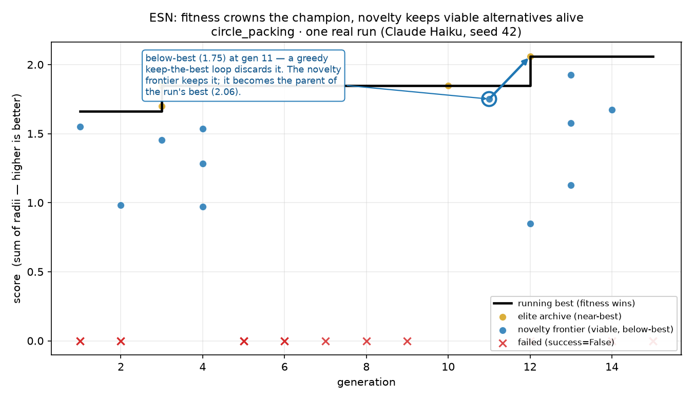

# ESN - Epistemic-Spectral-Novelty

[](https://github.com/barkain/esn/actions/workflows/ci.yml)

**Spend your LLM budget on candidates that are both *good* and *genuinely new*.**

---

## What it is

`esn` runs **LLM-driven evolutionary search**: an LLM proposes mutations
of a candidate solution, those candidates are compiled and scored, and the best
ones become parents for the next round. That much is the familiar "LLM in a
loop" pattern.

The difference is *what gets selected*. A naive loop keeps whatever scored
highest, so it quickly collapses onto one idea and burns expensive LLM calls
re-deriving variations of the same approach. `esn` instead steers
selection with an **epistemic spectral-novelty signal**: it maintains a memory
of the structures it has already learned, runs a spectral analysis over that
memory, and measures how *structurally unlike* each new candidate is from
everything understood so far (the spectral-novelty score, `N_sp`).

When spectral structure passes its quality gates, `N_sp` is blended with an
**epistemic-novelty** term into a single *unified novelty* score, which then
biases selection on **two fronts** — without ever letting novelty override
fitness:

- **The champion is chosen by fitness.** The run's best is the highest-scoring
  *viable* candidate (it must clear a small improvement deadband). Novelty does
  not tie-break or overrule score here.
- **Novelty biases which viable-but-not-best candidates survive.** Successful
  non-elite candidates are admitted to and ranked in a **frontier archive by
  unified novelty**. Frontier members are then *one* parent source — sampled
  alongside the current best, live branches, and under-explored families — to seed
  the next generation. So a structurally new idea that scored just below the best
  can be preserved and seed future mutations instead of being discarded the way a
  naive loop would. (The LLM/mutator still authors every candidate; novelty only
  shapes which survive to be built on.)

The result is exploration that does not crash fitness and exploitation that does
not stagnate. (The design intent is often summarized as an *epsilon-band Pareto*
rule — "among viable candidates, prefer the most novel"; for exactly how the
implementation realizes that and where the two diverge, see
[docs/how-it-works.md](docs/how-it-works.md).)



*How routing works, on one real `circle_packing` run (Claude Haiku, seed 42):
fitness crowns the champion, while the novelty frontier keeps viable-but-below-best
candidates alive — here the run's best (2.06) happened to descend from a
**below-best** candidate (1.75) the frontier preserved. This is a single-run
illustration of the **mechanism**, not a performance claim: in controlled
multi-seed tests, novelty-guided vs fitness-only search were statistically
indistinguishable on this benchmark. Reproducible scripts/data:
[`docs/assets/`](docs/assets).*

---

## Install

This project is **uv-only** — [`uv`](https://docs.astral.sh/uv/) is both the
installer *and* the sandbox runtime that executes every candidate the search
generates, so it must be on your `PATH` (check with `uv --version`). Install
from source:

```bash
git clone https://github.com/barkain/esn.git
cd esn
uv sync   # offline core (pydantic + numpy) — no LLM deps
```

Bare `uv sync` installs the **offline core**. Add the extra each path needs:
`--extra agent` (key-free Claude subscription), `--extra llm` (OpenAI/Anthropic
API keys), `--extra novelty` (learned-embedding `N_sp`). Requires Python ≥ 3.10.

---

## Quickstart

### Agentic Mutation

A multi-turn Claude *agent* proposes each mutation. `make_agent_mutator` +
`make_agent_analyzer` authenticate through your local Claude install / macOS
keychain — **no API key**. Pass a real `analyzer` so novelty (`N_sp`) is active
(without one `esn.run` warns and runs without novelty — no hypothesis memory
forms, so `N_sp`/epistemic/unified novelty stay inactive; the engine still uses
its score, archive, branch, family, and search-mode heuristics).

```bash
uv sync --extra agent --extra novelty   # subscription SDK + learned-embedding N_sp

uv run python examples/run.py --domain circle_packing \
    --mutator agent --analyzer agent \
    --generations 20 --batch-size 2 --seed 42
```

### Linear Prompt-Response Mutation

One LLM completion proposes each mutation — faster and cheaper, billed to a
provider API key chosen by model name (`gpt-*` → `OPENAI_API_KEY`, `claude-*` →
`ANTHROPIC_API_KEY`):

```bash
uv sync --extra llm --extra novelty
export OPENAI_API_KEY=...   # or ANTHROPIC_API_KEY=... for a claude-* model

uv run python examples/run.py --domain circle_packing \
    --mutator llm --analyzer llm \
    --mutation-model gpt-4o --analysis-model gpt-4o-mini \
    --generations 20 --batch-size 4 --seed 42 \
    --spectral-threshold-mode hybrid --enable-recombination
```

Useful extra knobs on the same runner:

| Flag | What it does |
|---|---|
| `--mutator diff` | SEARCH/REPLACE incremental edits instead of full-rewrite ([docs/mutators.md](docs/mutators.md#edit-format-full-rewrite-vs-diff)) |
| `--analyzer none` | fitness-only (novelty off) — the ablation baseline |
| `--no-predictor` | disable the Task-1 predictor; by default a predictor (the prediction-surprise novelty term) is wired whenever the analyzer activates novelty |
| `--tune` | optional **continuous-parameter polish** ([`ParameterTuner`](src/esn/engine/tuner.py)): evaluator-guided search over a candidate's float literals. Helps continuous-parameter problems; a safe no-op on combinatorial/structural ones. Not a structural-escape tool; spends extra evaluator calls |
| `--enable-divergence` | **experimental, off by default**: forced structural-escape slot on stagnation. A controlled A/B showed no escape benefit; kept opt-in for study |
| `--seeds 42,7,123` | run several seeds sequentially and print the mean |
| `--eval-timeout 120` | per-candidate evaluation timeout (seconds) |
| `--max-tokens 16384` | raise the completion cap so long programs aren't truncated |
| `--task-prompt "…"` | override the task description the mutator sees (inject hints) |
| `--repair` | `circle_packing`: cheaply project invalid packings to feasibility before scoring (changes the evaluation — see note below) |

> `--repair` makes the evaluator *repair-tolerant* (it shrinks overlapping /
> out-of-bounds circles to a valid packing before scoring). It's a search aid, not
> the standard benchmark — scores produced with `--repair` are **not** comparable
> to unrepaired results.

`uv run python examples/run.py --help` lists every flag. See
[docs/mutators.md](docs/mutators.md) for agent-vs-linear (and the diff edit
format), and [Use it on your own problem](#use-it-on-your-own-problem) to wire a
new task in Python.

## Credentials / API keys

| Component | Factory | Key | Extra |
|---|---|---|---|
| Agentic mutator/analyzer (subscription) | `make_agent_mutator` · `make_agent_analyzer` | **none** (local Claude / keychain) | `agent` |
| LLM mutator/analyzer/predictor | `make_llm_mutator` · `make_analyzer` · `make_predictor` | `gpt-*`/`o*` → `OPENAI_API_KEY`, `claude-*` → `ANTHROPIC_API_KEY` | `llm` |
| Embedder (novelty) | auto (once an analyzer is passed) | none (local model) | `novelty` |

## Core concepts

- **`N_sp` (spectral-novelty score)** — a gated measurement of how *structurally unlike* a candidate is from everything learned so far; one input (blended into *unified novelty*) that biases which viable candidates survive.
- **Hypothesis** — what the analyzer extracts from each evaluated candidate; the memory `N_sp` is measured against.
- **Spectral analysis** — the decomposition over that hypothesis memory used to compute `N_sp`.
- **Fitness-gated selection** — the run's best is the highest-scoring *viable* candidate (novelty never overrides score); novelty instead ranks the **frontier archive** and feeds parent selection, deciding which viable-but-not-best ideas survive to be explored next. (Often summarized as an *epsilon-band Pareto* intent — "among viable candidates, prefer the most novel.")

For the full mechanism — the generation loop, the spectral math behind `N_sp`,
how candidates are selected and archived, and where the implementation diverges
from the *epsilon-band Pareto* framing — see **[docs/how-it-works.md](docs/how-it-works.md)**.

---

## Use it on your own problem

You apply `esn` to a new problem by writing **one object: a `DomainSpec`** — a
problem description, a seed program, a sandbox compiler, an evaluator that scores
candidates (higher = better), and a few natural-language hints. The engine is
domain-agnostic and never changes.

See **[docs/connecting-a-problem.md](docs/connecting-a-problem.md)** for the
fields, the `solve` vs `stdio` interfaces, the evaluator contract, and a minimal
copy-paste example.

## Mutators

The mutator proposes each candidate. ESN supports a **single-shot LLM** mutator
(`esn.make_llm_mutator`, the fast/cheap default) and an **agentic** Claude Agent
SDK mutator (`esn.make_agent_mutator`, for harder / research-augmented runs).
They are interchangeable via `esn.run(domain, mutator=...)`.

See **[docs/mutators.md](docs/mutators.md)** for the comparison and one-liners.

---

## Bundled examples

Three complete `DomainSpec` implementations ship in [`examples/`](examples/) as
working references:

- [`examples/circle_packing/`](examples/circle_packing) — pack *n* circles into a
  unit square to maximize the sum of radii. A continuous-geometry domain;
  good for seeing exploration vs. exploitation trade-offs.
- [`examples/tsp/`](examples/tsp) — travelling-salesman tour minimization over the
  bundled instances. A combinatorial domain with a `stdio` program interface.
- [`examples/local_sqli_lab/`](examples/local_sqli_lab) — applying ESN to
  **authorized security testing**: evolve a SQL-injection (CWE-89) that extracts a
  hidden secret from a self-contained, in-process vulnerable SQLite endpoint. The
  candidate is a pure payload-strategy generator; the evaluator owns all target
  I/O and scores a **non-gameable** continuous distance-to-exploit ladder up to
  full blind extraction. Offline and CI-safe — no external target.

Each example is a self-contained template: copy the directory, swap in your
problem's `description`, `initial_code`, `evaluator`, and constraints, and you
have a new domain.

---

## Architecture

The engine is **domain-agnostic** and composed of pluggable parts. You provide a
`DomainSpec`; everything else is swappable behind a small set of protocols.

```
DomainSpec ─┐
            │   ┌──────────────────────────────────────────────┐
 Mutator ───┼──▶│  ESNEngine                                  │
            │   │   1. mutate parents      (Mutator)            │
 Compiler ──┤   │   2. compile candidate   (ProgramCompiler)    │
            │   │   3. evaluate → fitness  (DomainSpec.evaluator)│
 Novelty ───┘   │   4. score novelty N_sp  (NoveltyComputer)    │
                │   5. promote best by fitness; rank frontier   │
                │      by novelty; pick parents branch-aware     │
                │   6. update memory / archives → loop          │
                └──────────────────────────────────────────────┘
```

Pluggable seams (Python `Protocol`s):

- **Mutator** — proposes new candidates. `make_agent_mutator` (key-free
  agentic) or `make_llm_mutator` (single-shot LLM).
- **Compiler** (`ProgramCompiler`) — turns candidate code into a runnable
  artifact. The bundled uv-subprocess compiler isolates each candidate in its
  own `uv run` environment.
- **Novelty** (`NoveltyComputer`) — the spectral-novelty signal that scores how
  structurally new a candidate is relative to learned memory.

Swap any one of these without touching the others; the engine only depends on
the protocols.

---

## License

Licensed under the **Apache License, Version 2.0**. See [`LICENSE`](LICENSE).

---

## Citation

If you use this library in academic work, please cite:

```bibtex
@software{esn,
  title  = {ESN: Epistemic Spectral Novelty},
  author = {Barkai, Nadav},
  year   = {2026},
  url    = {https://github.com/barkain/esn}
}
```
