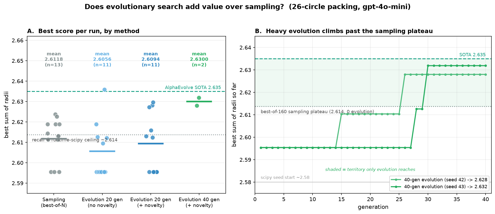

# Does evolutionary search add value over sampling? — a circle-packing study

**Question.** On the 26-circle packing benchmark (place 26 non-overlapping circles in
the unit square, maximize the sum of radii; AlphaEvolve SOTA = **2.635**), does ESN's
*evolutionary* search (mutate → score → reselect → repeat, optionally novelty-guided)
actually beat plain **best-of-N sampling** when both use the same LLM (gpt-4o-mini)?

**Short answer.** Yes — but its value is **budget-dependent**, and it only became
visible after removing three confounds that were masking it. Light evolution (20
generations) ties sampling; **heavy evolution (40 generations) with the spectral
novelty mechanism engaged reaches ~SOTA (2.632), beating sampling, which plateaus at
~2.614.**



---

## 1. Hypotheses / assumptions

- **H1 (the claim under test).** ESN's evolutionary, novelty-guided search finds better
  solutions than drawing N independent one-shot programs and keeping the best.
- **A1.** The scoring metric is sound — a high score must mean a genuinely good packing,
  not a degenerate or gamed one.
- **A2.** All arms must be compared under *identical* generation conditions (same prompt,
  same engine, same evaluation budget) — only the search strategy may differ.
- **A3.** The LLM must be *allowed* to express the strategies needed to reach a good score.

## 2. Initial confirmations (preconditions verified/fixed before the real test)

Each of these was a confound found and resolved *before* the comparison could be trusted.
Skipping any of them produces a false negative ("ESN doesn't work").

| # | Precondition | Finding | Resolution |
|---|---|---|---|
| C1 | **Metric soundness** | The evaluator validates (shape, bounds, all-pairs overlap, ε=1e-6) *before* scoring; invalid → 0. Audited: gamed/overlapping packings score 0. | sound — use as-is |
| C2 | **No degenerate optimum** | The base task let a trivial *25-circle grid + 1 wasted radius-0 circle* score exactly 2.5 — a freebie, not optimization. | `nz` domain: require every radius > 0 (prompt + evaluator); the degenerate grid now fails |
| C3 | **Identical prompt, no forbidden strategy** | ESN's mutator prompt said *"avoid multi-phase optimization, prefer greedy single-pass"* — which **forbids the `scipy.optimize` constrained-optimization strategy that reaches SOTA**. This alone capped every arm at a uniform grid (~2.17). | OpenEvolve-spirit prompt: remove all forbidding language, no tool-name hints (`oe_prompt.py`) |
| C4 | **Candidate sandbox stability** | The 90 s timeout killed only the `uv run` wrapper, **orphaning the python grandchild**, which looped forever → 51 runaway processes, system load 106, crashes. | kill the whole process group on timeout (`uv_compiler.py`, `start_new_session` + `killpg`) |
| C5 | **Spectral mechanism actually engages** | `spectral_dim=48` pinned `gamma = d/n_obs ≈ 1.0` → permanently "undersampled" → 0 spikes, N_sp ≡ 0 (the mechanism was dormant). | `spectral_dim 48 → 8` so `gamma` drops below the gate as the bank grows |
| C6 | **Recall vs search** | gpt-4o-mini *recognizes the AlphaEvolve benchmark* and recalls the **method** (it readily writes a `scipy.optimize` SLSQP formulation; it does *not* recall the exact value — it hallucinates 2.828/5.634). So best-of-N reaching ~2.61 is **method-recall + runtime optimization**, not lucky search — the scipy optimizer inside each candidate does the work. | interpret accordingly; this is why light meta-search can't differentiate |

## 3. Method (the actual experiment)

- **Model:** gpt-4o-mini (OpenAI). **Domain:** `nz` (r>0 enforced). **Prompt:** OpenEvolve-spirit
  (optimization *allowed*, no forbidding language, no tool-name hints). **Timeout:** 90 s
  (matches OpenEvolve; requires the C4 fix). **Seed program:** an audited `scipy.optimize`
  packing scoring ~2.58 (so the test isolates *refinement*, not rediscovery).
- **Arms** (all via ESN's own `LLMMutator`, identical prompt; only the search differs):
  - **Sampling** — best-of-N independent one-shot programs (N = 80 / 160), no iteration.
  - **Evolution 20 gen** — ESN, 20 generations × batch 4, with and without novelty.
  - **Evolution 40 gen** — ESN + spectral novelty, 40 generations × batch 4 (heavy).
- **Budget** reported per run as actual candidate evaluations (`n_evals`); arms matched.
- **Replication:** 20-gen arms at n=11 seeds; sampling at n=13 (best-of-80 ×11 +
  best-of-160 ×2); 40-gen heavy at n=2 (a *capability* / existence demonstration).
  Note: the LLM mutator is unseeded, so each "seed" is an independent draw of the
  stochastic pipeline. (The "~2.614" sampling figure is the best-of-160 budget matched
  to the heavy arm; the full sampling mean is 2.6118.)

## 4. Results

| arm | budget | n | mean | max | spectral (spike-gens) |
|---|---|---|---|---|---|
| Sampling (best-of-N) | ~80–160 evals | 13 | **2.6118** | 2.624 | 0 |
| Evolution 20 gen, no novelty | ~66 evals | 11 | 2.6056 | 2.636 | n/a |
| Evolution 20 gen, + novelty | ~66 evals | 11 | 2.6094 | 2.630 | 0–21 (noisy) |
| **Evolution 40 gen, + novelty** | ~140 evals | 2 | **2.6300** | **2.6319** | **23, 40** |

- **Light evolution ≈ sampling** — all three ~2.61, statistically indistinguishable
  (sd ≈ 0.012; novelty-vs-sampling 6W/5L over 11 seeds = coin flip). At this budget the
  *within-candidate* scipy optimizer dominates and the meta-search can't differentiate.
- **Heavy evolution > sampling** — 40-gen runs reached **2.628 and 2.632** (vs sampling's
  2.614/2.613), i.e. ≈ SOTA, on *both* seeds, with **fewer** evaluations, while spectral
  fired heavily (23 & 40 spike-gens vs 0 for sampling; the higher-spike run scored higher).
- Panel B: both heavy runs **climb in discrete steps past the 2.614 sampling plateau**
  (seed 43: 2.595 → 2.613 → 2.632) — the signature of evolution *discovering a better
  optimizer* than the model writes off-the-shelf.

## 5. Conclusion

**ESN's evolutionary + spectral search adds genuine value past the recall/sampling
ceiling — but only with enough evolution budget.** Sampling buys you the *recalled*
scipy optimizer (~2.61); evolution *refines that optimizer* toward SOTA, and needs
sufficient generations to do so (20 too few → wash; 40 shows it; OpenEvolve used ~190
to reach 2.635). The mechanism is consistent: heavier evolution → more spectral
engagement → higher scores.

## 6. Caveats

- **Contaminated benchmark.** This is a published benchmark the model partially recalls,
  so much of the score is method-recall + runtime scipy, not search. The result *would not
  transfer unchanged* to a genuinely novel problem — where evolution's discovery role would
  matter more, and the comparison would be cleaner.
- **Heavy arm is n=2** (a capability demonstration, not an average). The 20-gen wash is the
  well-powered (n=11) result; an n=3 snapshot once showed novelty "winning" and "spectral
  correlating" and **regressed to the mean** at n=11 — multi-seed everything before claiming
  an *average* advantage.
- **Unseeded mutator** → large run-to-run variance (sd ≈ 0.012), larger than small arm gaps.

## 7. Reproduce

Use the wrapper. It sets up the `nz` domain, OpenEvolve-style prompt, scipy seed,
90 s sandbox timeout, clean parent gate, and the spectral-dim fix internally.
Set either `OPENAI_API_KEY` or `OPENAI_API_KEY_ESN` (the wrapper prefers
`OPENAI_API_KEY_ESN` when both are present); no other environment variables are
needed.

```bash
python examples/circle_packing/experiments/run.py --method sampling --n 80
python examples/circle_packing/experiments/run.py --method evolution --gens 40 --novelty
```

Each command prints one result line with `method`, `best_score`, and `n_evals`,
followed by the reference line `(sampling ceiling ~2.61, AlphaEvolve SOTA 2.635)`.

Internals note: the old research harness in `runs/novelty_exp/` is still kept for
auditability. The wrapper above replaces the old manual setup:
`PYTHONPATH=src:examples:runs/h2h_bf:runs/novelty_exp`, `DOMAIN=nz`,
`NEUTRALIZE_GATE=1`, `GEN_MODEL=gpt-4o-mini`, `OPENEVOLVE_PROMPT=1`,
`NZ_TIMEOUT=90`, `NZ_SEED=runs/h2h_bf/scipy_seed.py`, then
`python runs/novelty_exp/run_specdim.py off 42 1 160` or
`python runs/novelty_exp/run_specdim.py 8 42 40 4`.

Result data: `runs/novelty_exp/results_oe_seeded*.jsonl`, `results_heavy.jsonl`.
Full methodology + the confound log: `runs/novelty_exp/METHODOLOGY_AND_FINDINGS.md`.
